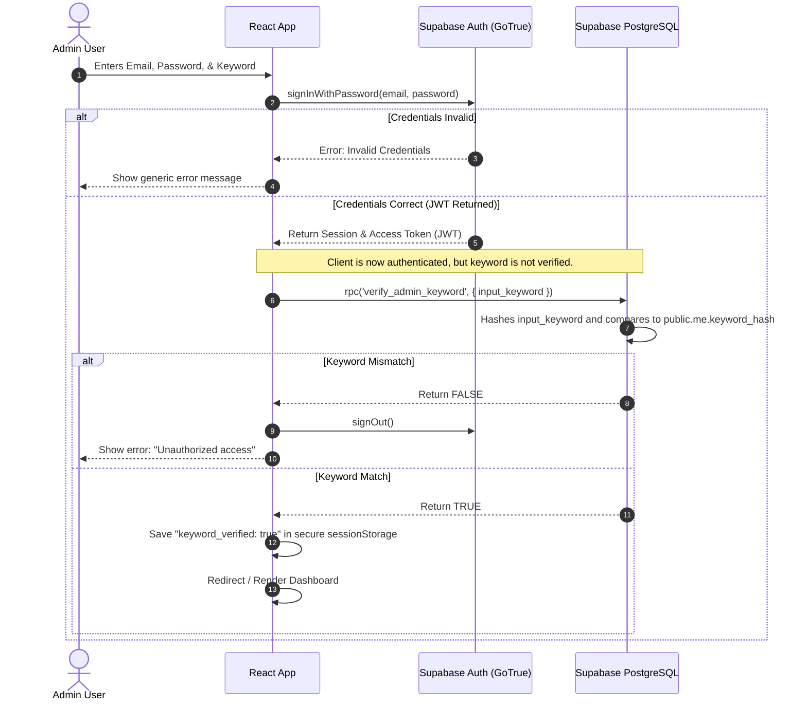

# Authentication Flow: Skylink Bundlefasta

This document details the secure multi-factor authentication (MFA) implementation for the single admin user.

## 🔐 Authentication Requirements
The dashboard is designed for **single admin access** only. Public registration is disabled.
To authenticate, the user must provide three credentials:
1. **Email**
2. **Password**
3. **Secret Keyword**

All three credentials must match before access to the dashboard is permitted.

---

## 🔄 Login Flow Diagram

---

## 🔒 Security Specifications

### 1. Hashing & Storage
- **Password**: Hashed and managed automatically in the `auth` schema by Supabase Auth (bcrypt).
- **Keyword**: A secure SHA-256 hash of the keyword is stored in `public.me.keyword_hash` (or generated using PostgreSQL's `crypt` function from the `pgcrypto` extension). The raw keyword is **never** stored in the database.

### 2. Protected Routes & Navigation Protection
- Any page change triggered by the `NavigationContext` must first check if a valid session exists AND `keyword_verified === true` is stored in the session state.
- If the session is missing or expired, the user state is reset, and they are redirected back to the login screen.
- RLS (Row Level Security) policies on the database ensure that even if a user holds a valid Supabase JWT, they cannot fetch data from tables unless their `id` matches the admin profile in `public.me`.

### 3. Logout Flow
When the user clicks "Log Out":
1. Call `supabase.auth.signOut()` to invalidate the Supabase session token.
2. Clear the keyword verification flag from state and `sessionStorage`.
3. Reset `NavigationContext` to default (`Dashboard`).
4. Re-render the login page.

### 4. Forgot Password Flow
Since this is a single-user system:
- The forgot password flow displays a recovery email input.
- On submit, it calls `supabase.auth.resetPasswordForEmail()`.
- The admin receives a recovery link.
- In a production setup, password resets are restricted to the pre-configured admin email address only.
