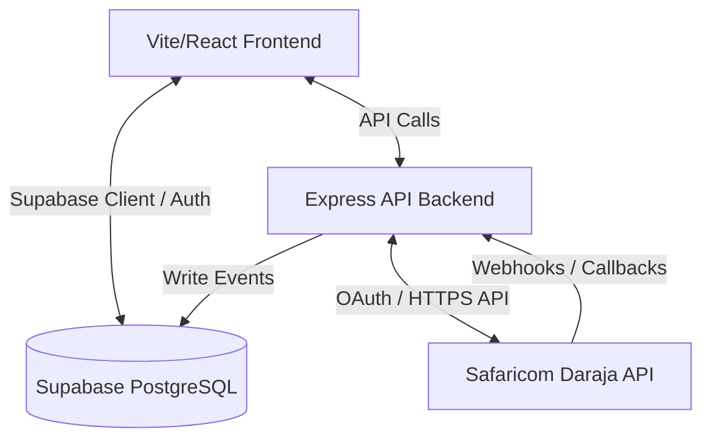

# Project Architecture: Skylink Bundlefasta

This document details the architectural layout, data flow, and design patterns of the Skylink Bundlefasta project.

## 🧭 System Overview
Skylink Bundlefasta is a single-user admin dashboard that serves as a middleware console for M-Pesa Daraja operations. It coordinates between:
1. **Frontend App**: Client interface for visualizing transactions, triggering STK push requests, initiating reversals, and reconciling accounts.
2. **Supabase Database**: Stores transactions, incoming payments queues, audit logs, and admin credentials.
3. **M-Pesa API / Express Backend**: Handles Daraja authentication and communicates with Safaricom endpoints securely.

---

## 🎨 Frontend Architecture
The frontend is built using **React 19** and **Vite** as the bundler.

### Styling & Theme System
- Built on **Tailwind CSS v4** using the `@theme` directive in `src/index.css`.
- Uses CSS variables for color values (`--color-brand-bg`, `--color-brand-panel`, `--color-brand-accent`).
- Light/Dark mode is supported by toggling the `.dark` class on the root element.
- Fonts: Uses the **Outfit** Google Font.

### Routing & Navigation
To maintain a fast, single-user dashboard experience without full page refreshes, the app implements a lightweight navigation model:
- **No Client-side Router**: Instead of `react-router-dom`, a React Context (`NavigationContext.tsx`) manages the active page state (`activePage`).
- **Conditional Rendering**: `src/App.tsx` reads `activePage` and renders the appropriate page component dynamically.

### State Contexts
The application distributes global states across specialized Context Providers:
- `ThemeProvider`: Manages theme selection (dark/light) and system overrides.
- `NavigationProvider`: Controls page-level routing.
- `SearchProvider`: Handles global search terms typed in the header bar.
- `LayoutProvider`: Controls layout parameters (such as the collapsible sidebar).

---

## 🔒 Security Boundaries
- **Credentials Isolation**: M-Pesa Consumer Keys, Secrets, and Passkeys are stored in the database (`public.mpesa_credentials`) and accessed exclusively by the backend. They are never transmitted to the frontend.
- **Single Admin Restriction**: Public registrations are disabled on the Supabase database. Only one authenticated user is allowed to sign in.
- **Protected Actions**: Sensitive transactions (such as reversals) require checking audit logs and updating state securely.
